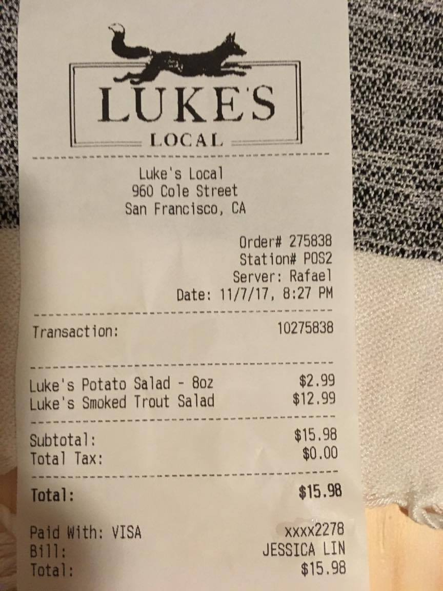

# Instabase Challenge @ HackMIT

**Prize: $1000 to split amongst the team**    -    instabase.com/hackmit

Instabase is a data processing platform providing services such as OCR, text extraction, natural language processing, and text classification. We're awarding $1,000 to the team that demonstrates the best use of our platform to solve a problem! More specifically, solve a problem using our platform to do:

* Optical Character Recognition
* Natural Language Processing
* Clustering and classification
* Information extraction and web scraping
* Python Scripting

Visit instabase.com/hackmit for more information about our API.


## Getting Started

### 1. Create an account on Instabase

In order to create an account, go to [our registration page](https://www.instabase.com/account/register?use_token=true) and use the following token:

```
hack-mit-2019
```

### 2. Create a new workspace/repository

A repository/workplace is a place to hold all of your code. Create one by clicking "New Workspace" in the Workspaces menu.


You can also share workspaces by clicking the IB icon and clicking the share icon next to the workspace name.


### Quick terminology / explanation

Instabase let's you automate data processing by creating **Flows**. A Flow is a series of steps, most typically OCR -> Extract Information. [Here](https://www.instabase.com/apps/flow/edit/vontell/hackmit/fs/Instabase%20Drive/information-extraction/InformationExtractionFlow.ibflow) is an example of an end-to-end solution.

To run a Flow, simply click Tools -> Run, and select an input folder with your documents.

[This page](https://www.instabase.com/docs/content/university/03_your_first_flow/index.html) has more information on a typical project setup.

### Need Help?

We will be here all weekend to help with your projects! Come by our booth in the area, or contact our mentor at aaron@instabase.com

You can also text our mentor at (860) 805-0050


## What can I do with Instabase?

Below is a list of just a few of the capabilities of Instabase. Follow the link for each one and copy the folder into your workspace/repository. Each project has a README detailing the capabilities and how to run that project.

For a full list of features and documentation, visit our [documentation site](https://www.instabase.com/docs/index.html).

**To start using these projects, right click the folder and click "copy" to copy the code into your own workspace.**

### Extract Text from Images (OCR)

Instabase provides a process for extracting text from images, PDFs, scans, emails, and more, with a variety of document quality. The output can include character-level confidence and positional information as well. Instabase OCR can also
handle document rotations.

Try it out by [running the project flow](https://www.instabase.com/docs/content/apps/flow/run-flow.html).

Example output for a receipt can be [found here](https://www.instabase.com/apps/ocr/review-doc/vontell/hackmit/fs/Instabase%20Drive/ocr-text-extraction/samples/out/s1_process_files/traderj_1.jpg.ibocr?i=0&ibflowresults=#) (click View Text), with many more [found here](https://www.instabase.com/vontell/hackmit/fs/Instabase%20Drive/ocr-text-extraction/samples/out/s1_process_files/).



```
            LUKES
                    LOCAL
                  Luke's  Local
                 960 Cole  Street
                San Francisco,  CA
                                  Order# 275838
                                  Station# POS2
                                 Server: Rafael
                        Date:  11/7/17, 8:27  PM
 Transaction:                          10275838
 Luke's  Potato  Salad  - 8oz              $2.99
 Luke's  Smoked  Trout  Salad             $12.99
 Subtotal:                                $15.98
 Total  Tax:                               $0.00
 Total:                                    $15.98
Paid  With:  VISA                       XXXX2278
 Bill:                               JESSICA  LIN
 Total:                                    $15.98
 ```

[View the project here](https://www.instabase.com/vontell/hackmit/fs/Instabase%20Drive/ocr-text-extraction/)

### Extract Information from Documents/Images

Instabase provides tools and techniques for extracting information from documents. For instance, given the OCR and scan of the receipt example above, we can easily extract items such as name, total amount, subtotal, and more. Using an app called Refiner, we provide over 50 various functions for extracting information.


A list of all functions available are found [here](https://www.instabase.com/docs/content/functions/index.html), including everything from regex-based extraction to advanced NLP techniques.

[View the project here](https://www.instabase.com/vontell/hackmit/fs/Instabase%20Drive/information-extraction/)

Try it out by [running the project flow](https://www.instabase.com/docs/content/apps/flow/run-flow.html).


### Classifying Text-based Documents

An automated process for classifying and extracting information from document is available on Instabase. We provide a few different classification techniques to get you started that work great on most documents, and allow you to create your own classifiers.


Full documentation can be found [here](https://www.instabase.com/docs/content/apps/classifier/index.html), while an example project to get you started can be found [here](https://www.instabase.com/vontell/hackmit/fs/Instabase%20Drive/document-classifier/).


Try it out by [running the project meta flow](https://www.instabase.com/docs/content/apps/flow/run-flow.html).

### Jupyter Notebooks

Instabase provides hosted Jupyter Notebooks that have access to Instabase functionality. Creating a notebook is as easy as clicking "New" > "New Notebook". 

[See an example notebook here](https://www.instabase.com/vontell/hackmit/fs/Instabase%20Drive/jupyter-notebook/)

*Note: Sometimes renaming a notebook will say that it failed - clicking rename again will fix that issue.*

## Common FAQ

### How do I use Instabase via API?

Most Instabase functionality is available through both UI and and API. In order to use Instabase via API (for instance, to run Flows, OCR, NLP, read and write files, etc...), create an access token by doing the following:

1. Go to [instabase.com](https://www.instabase.com/)
2. Click the IB Icon (to access the main menu)
3. Hover over "Help"
4. Click "Developer SDK"
5. Click "New Application" in the top right of the screen
6. Enter a name and description for your project
7. Copy the Access Token generated for your project

Details for API calls can be found [in our documentation](https://www.instabase.com/docs/content/apis/index.html)

The Access Token is passed via a header in your HTTP requests. For instance, in Python this might look like the following:

```python
url = 'some/url/to/instabase/features'
headers = {
  'Authorization': 'Bearer {0}'.format(my_access_token),
  'Instabase-API-Args': json.dumps(my_api_arguments)
}
resp = requests.post(url, headers=headers).json()
```

## Join Instabase!

Looking for an internship or full time opportunity? Check out our [career page](https://www.instabase.com/about/careers/).


[](http://www.youtube.com/watch?v=9M4zqGCE2kk)

Curious about what our internships are like? Check out [this blog post](https://blogs.instabase.com/interning-at-instabase-the-10-million-dollar-ideas-b8cbb1168ed3) from one of our recent interns!